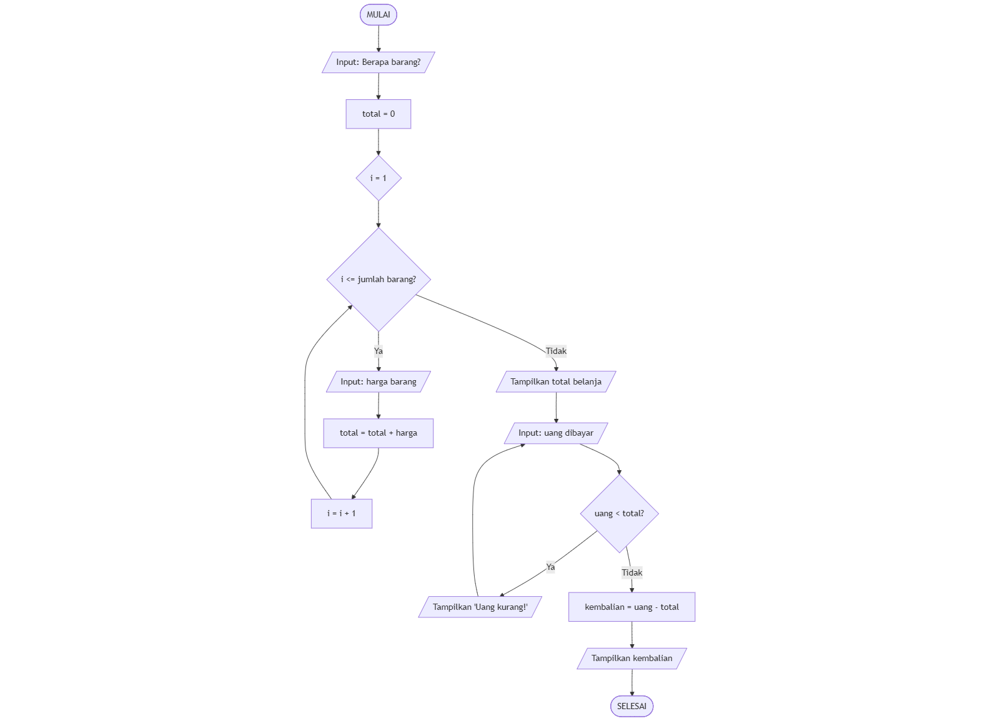
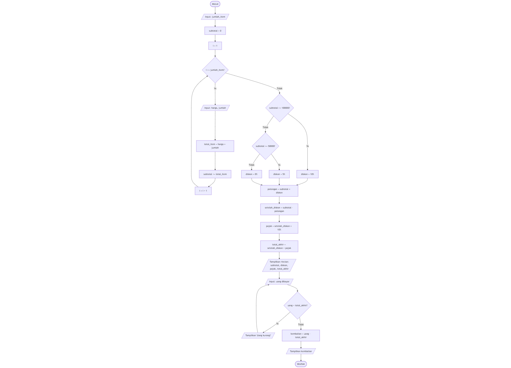

# Materi Studi Kasus: Sistem Kasir dengan Python

## Pengenalan Berpikir Komputasi

**Berpikir Komputasi** adalah cara memecahkan masalah dengan 4 langkah:
1. **Dekomposisi**: Memecah masalah besar jadi bagian kecil
2. **Pengenalan Pola**: Mencari kesamaan dalam masalah
3. **Abstraksi**: Fokus pada informasi penting saja
4. **Algorithm**: Membuat langkah-langkah solusi

---

## LEVEL MUDAH: Kasir Sederhana

### Deskripsi Masalah
Buatlah program kasir untuk warung yang dapat:
- Menghitung total belanja dari beberapa barang
- Menghitung kembalian dari uang yang diberikan pelanggan

### Dekomposisi Masalah
1. Input harga barang
2. Hitung total belanja
3. Input uang pembayaran
4. Hitung kembalian
5. Tampilkan hasil

### Flowchart



### Pseudocode

```
ALGORITMA KasirSederhana
DEKLARASI
    jumlah_barang : integer
    total : integer = 0
    harga : integer
    uang_dibayar : integer
    kembalian : integer
    i : integer

DESKRIPSI
    TULIS "=== KASIR WARUNG ==="
    
    BACA jumlah_barang
    
    UNTUK i ← 1 SAMPAI jumlah_barang LAKUKAN
        TULIS "Harga barang ke-", i, ": "
        BACA harga
        total ← total + harga
    AKHIR UNTUK
    
    TULIS "Total Belanja: Rp", total
    
    ULANGI
        TULIS "Uang dibayar: Rp"
        BACA uang_dibayar
        
        JIKA uang_dibayar < total MAKA
            TULIS "Uang kurang! Masih kurang Rp", total - uang_dibayar
        AKHIR JIKA
    SAMPAI uang_dibayar >= total
    
    kembalian ← uang_dibayar - total
    TULIS "Kembalian: Rp", kembalian
    TULIS "Terima kasih!"
```

### Variabel dan Tipe Data

| Variabel | Tipe Data | Keterangan |
|----------|-----------|------------|
| `jumlah_barang` | Integer | Jumlah barang yang dibeli |
| `total` | Integer | Total harga belanja |
| `harga` | Integer | Harga per barang |
| `uang_dibayar` | Integer | Uang yang diberikan pelanggan |
| `kembalian` | Integer | Selisih uang dengan total |
| `i` | Integer | Counter untuk perulangan |

### Kode Python

```python
# Program Kasir Sederhana

print("="*40)
print("       KASIR WARUNG SEDERHANA")
print("="*40)

# Input jumlah barang
jumlah_barang = int(input("Berapa barang yang dibeli? "))

# Proses hitung total
total = 0
for i in range(1, jumlah_barang + 1):
    harga = int(input("Harga barang ke-" + str(i) + ": Rp "))
    total = total + harga

print("\n" + "-"*40)
print("Total Belanja: Rp " + str(total))
print("-"*40)

# Input uang dan validasi
uang_valid = False
while uang_valid == False:
    uang_dibayar = int(input("Uang dibayar: Rp "))
    
    if uang_dibayar < total:
        kurang = total - uang_dibayar
        print("Uang kurang! Masih kurang Rp " + str(kurang))
    else:
        uang_valid = True

# Hitung kembalian
kembalian = uang_dibayar - total
print("Kembalian: Rp " + str(kembalian))
print("\nTerima kasih sudah belanja!\n")
```

### Penjelasan Konsep

**1. Perulangan FOR**
```python
for i in range(1, jumlah_barang + 1):
    # Kode diulang sebanyak jumlah_barang
```
- Digunakan saat kita tahu berapa kali harus mengulang

**2. Perulangan WHILE**
```python
uang_valid = False
while uang_valid == False:
    # Kode diulang sampai uang_valid menjadi True
```
- Digunakan saat tidak tahu berapa kali harus mengulang

**3. Pengkondisian IF**
```python
if uang_dibayar < total:
    # Kode dijalankan jika kondisi benar
else:
    # Kode dijalankan jika kondisi salah
```

---

## LEVEL SEDANG: Kasir dengan Diskon

### Deskripsi Masalah
Buatlah program kasir toko yang dapat:
- Menghitung total belanja dari beberapa barang
- Memberikan diskon berdasarkan total belanja
- Menghitung pajak 10%
- Menghitung kembalian

**Ketentuan Diskon:**
- Total ≥ Rp 100.000 → Diskon 10%
- Total ≥ Rp 50.000 → Diskon 5%
- Total < Rp 50.000 → Tidak ada diskon

### Dekomposisi Masalah
1. Input harga barang dan jumlah
2. Hitung subtotal
3. Hitung diskon berdasarkan subtotal
4. Hitung pajak
5. Hitung total akhir
6. Input uang dan hitung kembalian

### Flowchart



### Pseudocode

```
ALGORITMA KasirDenganDiskon
DEKLARASI
    jumlah_item : integer
    subtotal : float = 0
    harga : float
    jumlah : integer
    total_item : float
    diskon_persen : float = 0
    potongan : float
    setelah_diskon : float
    pajak : float
    total_akhir : float
    uang_dibayar : float
    kembalian : float
    i : integer

DESKRIPSI
    TULIS "=== KASIR TOKO ==="
    TULIS "Berapa jenis barang? "
    BACA jumlah_item
    
    // Proses input barang
    UNTUK i ← 1 SAMPAI jumlah_item LAKUKAN
        TULIS "Barang ke-", i
        TULIS "Harga satuan: Rp"
        BACA harga
        TULIS "Jumlah: "
        BACA jumlah
        
        total_item ← harga × jumlah
        subtotal ← subtotal + total_item
        TULIS "Total item: Rp", total_item
    AKHIR UNTUK
    
    // Hitung diskon
    JIKA subtotal >= 100000 MAKA
        diskon_persen ← 0.10
    SELAIN JIKA subtotal >= 50000 MAKA
        diskon_persen ← 0.05
    SELAIN ITU
        diskon_persen ← 0
    AKHIR JIKA
    
    potongan ← subtotal × diskon_persen
    setelah_diskon ← subtotal - potongan
    pajak ← setelah_diskon × 0.10
    total_akhir ← setelah_diskon + pajak
    
    // Tampilkan rincian
    TULIS "Subtotal: Rp", subtotal
    TULIS "Diskon", diskon_persen × 100, "%: -Rp", potongan
    TULIS "Setelah Diskon: Rp", setelah_diskon
    TULIS "Pajak 10%: +Rp", pajak
    TULIS "TOTAL AKHIR: Rp", total_akhir
    
    // Pembayaran
    ULANGI
        TULIS "Uang dibayar: Rp"
        BACA uang_dibayar
        
        JIKA uang_dibayar < total_akhir MAKA
            TULIS "Uang kurang!"
        AKHIR JIKA
    SAMPAI uang_dibayar >= total_akhir
    
    kembalian ← uang_dibayar - total_akhir
    TULIS "Kembalian: Rp", kembalian
```

### Variabel dan Tipe Data

| Variabel | Tipe Data | Keterangan |
|----------|-----------|------------|
| `jumlah_item` | Integer | Jumlah jenis barang yang dibeli |
| `subtotal` | Float | Total sebelum diskon dan pajak |
| `harga` | Float | Harga satuan barang |
| `jumlah` | Integer | Jumlah barang yang dibeli |
| `total_item` | Float | Harga × jumlah per item |
| `diskon_persen` | Float | Persentase diskon (0.05 = 5%) |
| `potongan` | Float | Nominal potongan diskon |
| `setelah_diskon` | Float | Subtotal setelah dikurangi diskon |
| `pajak` | Float | Nominal pajak 10% |
| `total_akhir` | Float | Total yang harus dibayar |
| `kembalian` | Float | Selisih uang dengan total akhir |
| `i` | Integer | Counter untuk perulangan |

### Kode Python

```python
# Program Kasir dengan Diskon dan Pajak

print("="*50)
print("              KASIR TOKO")
print("="*50)

# Input jumlah jenis barang
jumlah_item = int(input("\nBerapa jenis barang yang dibeli? "))

# Proses input dan hitung subtotal
subtotal = 0

print("\n" + "="*50)
for i in range(1, jumlah_item + 1):
    print("BARANG KE-" + str(i))
    harga = float(input("Harga satuan: Rp "))
    jumlah = int(input("Jumlah: "))
    
    total_item = harga * jumlah
    subtotal = subtotal + total_item
    
    print("Total item: Rp " + str(total_item))
    print("-"*50)

# Hitung diskon berdasarkan subtotal
if subtotal >= 100000:
    diskon_persen = 0.10
    diskon_text = "10%"
elif subtotal >= 50000:
    diskon_persen = 0.05
    diskon_text = "5%"
else:
    diskon_persen = 0
    diskon_text = "0%"

# Hitung potongan, pajak, dan total akhir
potongan = subtotal * diskon_persen
setelah_diskon = subtotal - potongan
pajak = setelah_diskon * 0.10
total_akhir = setelah_diskon + pajak

# Tampilkan rincian pembayaran
print("\n" + "="*50)
print("            RINCIAN PEMBAYARAN")
print("="*50)
print("Subtotal               : Rp " + str(subtotal))
print("Diskon " + diskon_text + "            : -Rp " + str(potongan))
print("Setelah Diskon         : Rp " + str(setelah_diskon))
print("Pajak 10%              : +Rp " + str(pajak))
print("="*50)
print("TOTAL AKHIR            : Rp " + str(total_akhir))
print("="*50)

# Input uang dan validasi
uang_valid = False
while uang_valid == False:
    uang_dibayar = float(input("\nUang dibayar: Rp "))
    
    if uang_dibayar < total_akhir:
        kurang = total_akhir - uang_dibayar
        print("Uang kurang! Masih kurang Rp " + str(kurang))
    else:
        uang_valid = True

# Hitung dan tampilkan kembalian
kembalian = uang_dibayar - total_akhir
print("Kembalian: Rp " + str(kembalian))
print("\nTerima kasih sudah berbelanja!")
print("="*50)
```

### Penjelasan Konsep Tambahan

**1. Tipe Data Float**
```python
harga = float(input("Harga: Rp "))
```
- Digunakan untuk angka desimal (contoh: 15.5, 1000.75)
- Penting untuk perhitungan diskon dan pajak yang bisa menghasilkan desimal

**2. Pengkondisian Bertingkat (IF-ELIF-ELSE)**
```python
if subtotal >= 100000:
    diskon_persen = 0.10
elif subtotal >= 50000:
    diskon_persen = 0.05
else:
    diskon_persen = 0
```
- Memeriksa kondisi secara berurutan dari atas ke bawah
- Hanya satu blok kode yang dijalankan

**3. Operasi Matematika**
```python
potongan = subtotal * diskon_persen  # Perkalian
total_akhir = setelah_diskon + pajak  # Penjumlahan
kembalian = uang_dibayar - total_akhir  # Pengurangan
```

**4. Konversi Tipe Data**
```python
str(total)  # Mengubah angka jadi string untuk penggabungan teks
int(input())  # Mengubah input jadi integer
float(input())  # Mengubah input jadi float
```

---

## Latihan Soal

### Level Mudah
1. Modifikasi program kasir sederhana agar menampilkan rata-rata harga barang
2. Tambahkan validasi agar harga barang tidak boleh negatif atau nol

### Level Sedang
1. Tambahkan fitur untuk menghitung total barang yang dibeli (penjumlahan semua jumlah)
2. Buat program yang menghitung berapa lembar uang kembalian (Rp 50.000, Rp 20.000, Rp 10.000, Rp 5.000, Rp 1.000)
3. Tambahkan diskon tambahan 3% jika pembeli adalah member (tanya dulu apakah member atau bukan)

---

## Rangkuman Konsep

| Konsep | Penggunaan | Contoh |
|--------|------------|--------|
| **Variabel** | Menyimpan data | `total = 0` |
| **Integer** | Bilangan bulat | `5`, `100`, `-3` |
| **Float** | Bilangan desimal | `15.5`, `0.10` |
| **String** | Teks | `"Halo"`, `"Rp"` |
| **Input** | Menerima data | `input()` |
| **Output** | Menampilkan data | `print()` |
| **FOR** | Perulangan pasti | `for i in range(5)` |
| **WHILE** | Perulangan kondisi | `while kondisi:` |
| **IF** | Percabangan tunggal | `if kondisi:` |
| **IF-ELIF-ELSE** | Percabangan bertingkat | `if-elif-else` |
| **Operator Aritmatika** | `+`, `-`, `*`, `/` | `total = harga + pajak` |
| **Operator Perbandingan** | `<`, `>`, `<=`, `>=`, `==` | `if uang >= total` |

---

## Tips Berpikir Komputasi

1. **Pahami masalah** - Baca dengan teliti apa yang diminta
2. **Pecah masalah** - Bagi jadi langkah-langkah kecil
3. **Cari pola** - Lihat bagian mana yang berulang
4. **Buat algoritma** - Tulis langkah-langkah solusi dalam pseudocode
5. **Tulis kode** - Terjemahkan algoritma ke Python
6. **Test & debug** - Coba dengan berbagai input dan perbaiki error

### Contoh Penerapan:
**Masalah:** Hitung total belanja 3 barang dengan diskon

**Dekomposisi:**
- Input 3 harga barang
- Jumlahkan semua harga
- Cek apakah dapat diskon
- Kurangi dengan diskon
- Tampilkan hasil

**Pola yang ditemukan:**
- Input harga diulang 3 kali → pakai FOR
- Perhitungan diskon tergantung total → pakai IF
